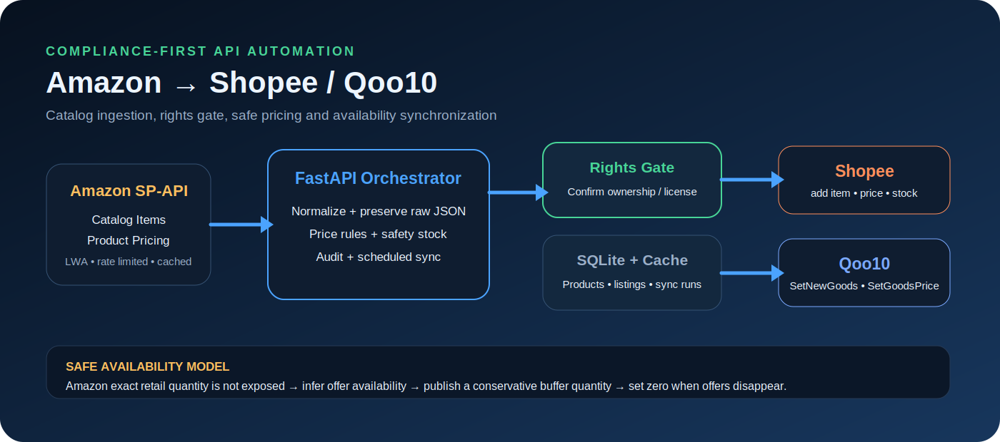

# Amazon Marketplace Sync Hub

## Generated Project Image


This image is generated by the automation harness during repository creation so the README contains a real visual asset, not only image-generation instructions.

Amazon SP-APIからASIN単位で商品カタログ・画像・識別子・寸法・カテゴリ・ランキング・価格候補・オファーを取得し、権利確認済みの素材をShopee/Qoo10へ出品、価格と販売可否を安全な頻度で同期するシステムです。




> 2026-07-16時点の公式仕様を前提にしています。旧Product Advertising APIは2026-05-15に廃止されたため、販売事業者向けのAmazon Selling Partner APIを主経路に採用しました。Creators API/旧PA-APIで取得したAmazon Program ContentはAmazonへの送客目的に限定されるため、Shopee/Qoo10出品へは転用しません。

## できること

- Amazon Catalog Items API: attributes / classifications / dimensions / identifiers / images / productTypes / relationships / salesRanks / summaries
- Amazon Product Pricing API: featured buying options / reference prices / lowest priced offers
- Amazon Product Pricing v0 offers: 新品オファーと配送・販売者関連情報の生レスポンス保存
- ASIN取得結果をSQLiteへキャッシュし、全レスポンスをJSONとして保持
- Shopee Open Platform: 画像アップロード、商品登録、価格更新、在庫更新
- Qoo10 QAPI: 販売者認証キー取得、商品登録、価格・販売数量更新
- 価格ルール、販売可否→安全在庫数変換、15分同期、429リトライ、操作履歴
- FastAPI管理画面、CLI、Docker、Codespaces、GitHub Actions、Cloudflare Pagesデモ

## 重要な制約

Amazon一般販売商品の**正確な残り在庫個数は公開APIから取得できません**。本システムはオファー有無を「販売可能/不可」として扱い、販売可能時も `STOCK_BUFFER_QUANTITY`（初期値2）だけを出品します。

Amazonの商品画像・説明文を他モールに転載できるとは限りません。APIは出品時に `rights_confirmed=true` を必須とし、自社撮影画像・メーカー提供素材・自社説明文の利用を推奨します。カテゴリー属性、危険物、医療・化粧品、ブランド承認、配送条件は各モールの審査が優先されます。

## すぐ試す

```bash
cp .env.example .env
python -m venv .venv
source .venv/bin/activate
pip install -e '.[dev]'
uvicorn app.main:app --reload
```

`http://localhost:8000` を開きます。初期状態は `APP_MODE=demo` なのでAPI資格情報なしで取得・出品・同期フローを確認できます。

```bash
market-sync fetch B0DEMO1234
market-sync list B0DEMO1234 --channels shopee qoo10 --rights-confirmed \
  --shopee-category-id 100 --qoo10-category-id 200 --shipping-no 1
market-sync sync
```

## 本番化

1. Amazon Solution Provider Portalでprivate SP-API applicationを登録し、自社Seller Centralで認可します。
2. Shopee Open Platformでアプリ承認・ショップ認可を行い、partner/shop credentialsを取得します。
3. Qoo10へQAPI利用申請を行い、API keyとQSM販売者情報を取得します。
4. `.env.example` のSecretsを本番Secret Storeへ設定し、`APP_MODE=production` と `API_LIVE_ENABLED=true` にします。
5. Docker対応サービスへFastAPIを配置し、Cloudflare Pagesの `PUBLIC_API_BASE_URL` をそのHTTPS URLへ向けます。

Secretsの実値はGitHubへ保存せず、Actions Secretsを使います。必要名と画面手順は [docs/setup.md](docs/setup.md) にあります。

## 同期設計

Catalog Itemsの既定レートを超えないキャッシュ、Pricing competitive summaryの低い既定レートに合わせた30.5秒間隔、429時のRetry-After対応を実装しています。GitHub Actionsは毎時4回（約15分間隔）で実行されます。商品数が増えたら20 ASINバッチ、通知駆動、永続DB/Queueへ拡張してください。

## API

- `GET /api/health`
- `POST /api/products/{asin}/fetch?force=false`
- `GET /api/products`
- `POST /api/listings`
- `GET /api/listings`
- `POST /api/sync/run`

Swagger UI: `/docs`

## プロジェクト構成

```text
app/connectors/amazon.py   Amazon LWA + SP-API
app/connectors/shopee.py   Shopee署名・出品・同期
app/connectors/qoo10.py    QAPI認証・出品・同期
app/services.py            価格/在庫ルールとオーケストレーション
app/main.py                FastAPI
app/static/index.html      管理画面 / Pagesデモ
.github/workflows/ci.yml   lint・test・Pages build
.github/workflows/sync.yml 15分同期とartifact
scripts/build_pages.py     Cloudflare Pages出力
```

詳細: [Architecture](docs/architecture.md) / [Setup](docs/setup.md) / [API research](docs/api-research.md)
