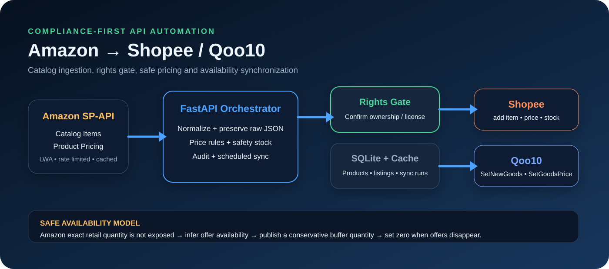

# Amazon Marketplace Sync Hub


Amazon Selling Partner API（SP-API）でASINのカタログ、価格候補、オファー有無を取得し、**販売者が権利を持つ商品名・説明・画像だけ**をShopeeへ登録し、価格と販売可否を同期するFastAPI / CLI / GitHub Actions基盤です。



## 現在の実装範囲

- Amazon Catalog Items API / Product Pricing API / Offers API
- Shopee Open Platform v2: shop接続確認、画像アップロード、`add_item`、価格・在庫更新
- LWAアクセストークン更新とShopee access/refresh token更新
- Shopeeのローテーション済みtokenを、任意の非公開永続ボリュームへ保存
- 本番APIのBearer/X-API-Key認証、CORS制限、Swagger無効化
- 権利確認、明示素材必須、画像ホストallowlist、重複SKU防止
- 為替、モール手数料、送料、最低利益、丸め単位を含む価格計算
- SQLite永続化、約15分間隔同期、GitHub ActionsのDB復元、Docker
- Cloudflare Pagesの管理画面デモ

公開デモ: `https://marketplace-sync-ops.pages.dev`

## 重要な前提

Amazon一般販売商品の正確な残り在庫数はSP-APIから取得できません。本システムはオファー有無を販売可否として扱い、販売可能でも `STOCK_BUFFER_QUANTITY`（既定1）だけをShopee在庫にします。

Amazonの商品画像・説明文を他モールへ自動転載しません。本番では `title`、`description`、`image_urls` を明示し、`rights_confirmed=true` が必要です。ブランド承認、カテゴリー必須属性、禁制品、危険物、税、配送、返品は販売者が各モールで確認してください。

## ローカルデモ

```bash
cp .env.example .env
python -m venv .venv
# Windows: .venv\Scripts\activate
# macOS/Linux: source .venv/bin/activate
pip install -e '.[dev]'
uvicorn app.main:app --reload
```

初期値は `APP_MODE=demo` です。外部APIへ送信しません。

```bash
market-sync fetch B0DEMO1234
market-sync list B0DEMO1234 --channels shopee --rights-confirmed \
  --shopee-category-id 100 --title "自社商品名" \
  --description "自社説明文" --image-url https://cdn.example.com/item.jpg
market-sync sync
```

## 本番化

1. Amazon Solution Provider Portalでprivate SP-API applicationを登録し、自社Seller Centralで認可します。
2. Shopee Open PlatformでPartner App承認とショップ認可を完了します。
3. `.env.example` の値を本番Secret Storeへ設定します。
4. `APP_MODE=production`、`API_LIVE_ENABLED=true`、限定した `CORS_ORIGINS`、十分長い `APP_API_TOKEN` を設定します。
5. 自社CDN/Storageだけを `IMAGE_HOST_ALLOWLIST` に設定します。
6. `TARGET_CURRENCY`、`SOURCE_TO_TARGET_FX_RATE`、`MARKETPLACE_FEE_RATE`、`SHIPPING_COST` を実際の販売国・契約に合わせます。
7. `market-sync preflight --channels amazon shopee --asin <ASIN>` を実行します。
8. Docker対応HTTPSホストへFastAPIを配置し、`data/` と `secrets/` を非公開永続ボリュームにします。

```bash
docker compose up -d --build
```

Shopee refresh tokenは一度使用するとローテーションします。長期稼働バックエンドでは `SHOPEE_TOKEN_STATE_FILE=/app/secrets/shopee-token-state.json` を使い、`secrets/` をバックアップ対象の非公開ボリュームとして保護してください。token stateはGitHub cacheやartifactへ含めません。

## GitHub Actions

- `Production Preflight`: Amazon LWAとShopee shop認可を外部変更なしで確認
- `List Product on Shopee`: ASIN、権利保有素材、category、価格/在庫を入力したときだけ実出品
- `Marketplace Sync`: 保存済みlisting DBを復元し、約15分間隔で価格と販売可否を同期

scheduled syncはリポジトリ変数 `MARKETPLACE_SYNC_ENABLED=true` を設定するまでskipされます。実出品と初回同期を検証した後だけ有効化してください。

Actionsのscheduled runnerは長期token stateを保持しないため、`SHOPEE_ACCESS_TOKEN` をActions Secretとして更新する運用です。完全自動のtokenローテーションは、永続 `secrets/` ボリュームを持つFastAPI/Dockerバックエンドで行います。

## API

`GET /api/health` だけは公開です。本番の次のAPIは `Authorization: Bearer <APP_API_TOKEN>` または `X-API-Key` が必要です。

- `POST /api/preflight`
- `POST /api/products/{asin}/fetch?force=false`
- `GET /api/products`
- `POST /api/listings`
- `GET /api/listings`
- `POST /api/sync/run`

詳細: [Production setup](docs/setup.md) / [Architecture](docs/architecture.md) / [API research](docs/api-research.md)
