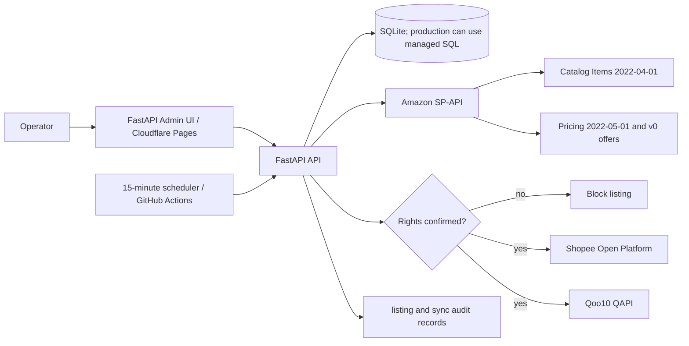

# Architecture

## 全体像



## 処理フロー

1. ASINを正規化・検証します。
2. TTL内の保存データがあればAmazon APIを呼ばず返します。
3. Catalog Itemsから商品属性一式、Product Pricingから価格候補とオファーを取得します。
4. 生JSONと正規化レコードをSQLiteへ保存します。
5. 出品時は素材利用権、カテゴリー、配送設定、価格ルールを検証します。
6. Shopee/Qoo10の公式APIで商品を登録し、外部商品IDを保存します。
7. 定期同期はAmazonを再取得し、販売可否を安全在庫数へ変換して価格・販売数を更新します。

## コンポーネント

- `AmazonSPAPIClient`: LWA access tokenを再利用し、SP-APIへ接続します。
- `AsyncRateLimiter`: Catalog 0.55秒、Competitive Summary 30.5秒、Offers 2.1秒の保守的間隔です。
- `Database`: 商品、生レスポンス、チャネル紐付け、同期結果を保存します。
- `MarketplaceService`: 権利ゲート、価格計算、安全在庫、チャネルAPI差分を吸収します。
- `Cloudflare Pages`: Secretsを持たない静的管理画面です。FastAPI URLが未設定の場合はデモモードになります。

## 価格・在庫

```text
target = round_up_10(max(amazon_price * markup + fixed_fee,
                         amazon_price + minimum_margin))
stock  = STOCK_BUFFER_QUANTITY when offer_available else 0
```

Amazon一般販売商品の正確な残数は利用しません。オファーが消えた場合は他モールを0在庫へ更新します。

## Security

ブラウザへSecretsを渡しません。Amazon LWA、Shopee partner/shop token、Qoo10 API key/passwordはFastAPIまたはGitHub ActionsのSecret Storeだけに置きます。ログへtoken、password、署名値を出しません。

## CI/CD

CIはPython 3.12でruff、pytest、Pages buildを実行し、JUnitと`dist/`をartifactへ保存します。Marketplace Syncは約15分間隔のcronとmanual dispatchを持ちます。Cloudflare Pagesはmainへのpushで自動デプロイされます。

## 今後の拡張

- PostgreSQL + Redis/Queue、商品単位の分散ロック
- Product Pricingの最大20 ASINバッチ化
- Shopee/Qoo10注文・キャンセルWebhookと横断引当
- 為替、送料、モール手数料、税を含む利益計算
- カテゴリー/属性マッピングUIと規制品承認フロー
